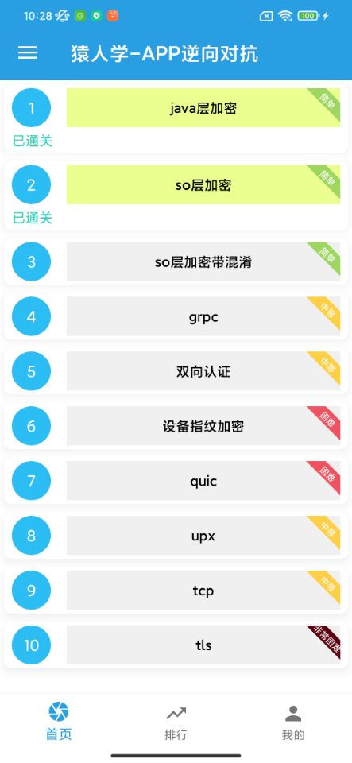

### app_yuanrenxue
#### 猿人学app逆向记录

1. [第一题纯算法](./cal_result/first_result.py)
2. [第二题 frida rpc调用](./cal_result/second_rpc.py)
3. [第三题 frida rpc调用](./cal_result/three_rpc.py)
---
###### [官网地址](https://appmatch.yuanrenxue.com/)    

---
[md5算法说明](./docs/md5.md)   
[md5算法实现](./encrypt_realize/encrypt_md5.py)
---
##### 猿人学app 截图如下

